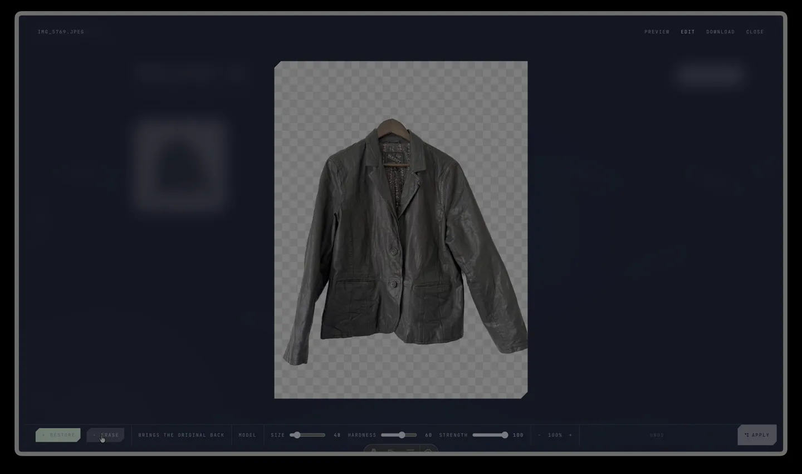

# Light Converter

Batch background removal that runs entirely in the browser. Drop one image or a hundred; the model runs on your own GPU, the cutouts come back as transparent PNGs, and nothing is ever uploaded. No account, no watermark, no server.

Free and open source under the MIT licence.

[](public/art/demo.mp4)

*Click to play — one image from drop to cutout to the editor, all on device.*

## What it does

- Removes backgrounds from batches of images, fully on device (WebGPU, with a WASM fallback).
- Two models: **BiRefNet** (swin_v1_tiny, fp16) on WebGPU for quality, **IS-Net** (int8) on WASM for machines without WebGPU.
- A second, contrast-boosted pass (CLAHE) kicks in automatically when the first mask is uncertain — this is what saves low-contrast shots like a white shirt on a white wall.
- Guided-filter edge refinement, hole filling, and speckle cleanup.
- Preview mode (swap backdrops, hold to compare) and an Edit mode with restore/erase brushes (size, hardness, strength), zoom and pan, undo, plus every model parameter exposed so you can re-run a single image with settings that fit it.
- Batches, originals and results live in IndexedDB. The model is fetched once and kept in Cache Storage, so the second visit is instant.
- Download one image or the whole batch as a zip.

## Requirements

- Node 20 or newer.
- A browser with WebGPU (Chrome, Edge, and recent Safari and Firefox) for the BiRefNet path. Anything else falls back to IS-Net on WASM.
- About 4 GB of free disk during the one-time model build (see below).
- Python 3 with a few packages, only for building the models.

## Running it locally

```sh
git clone https://github.com/lightScout/light-converter
cd light-converter
npm install                # also copies the onnxruntime WASM runtime into public/ort
npm run models             # one-time: downloads and converts the two models (~160 MB in public/models)
npm run dev                # http://localhost:4321
```

`npm run models` needs Python 3 with:

```sh
pip install onnx onnxruntime onnxconverter-common sympy
```

It downloads the original checkpoints from the authors' GitHub releases, converts BiRefNet to fp16 and quantises IS-Net to int8, and writes both into `public/models/`. The fp16 conversion takes a few minutes. Model files are git-ignored; they are never committed.

Production build:

```sh
npm run build              # static output in dist/
npm run preview
```

### Hosting

The site is static — any host works. Two things matter:

1. **Cross-origin isolation.** The WASM backend uses threads, which need these headers on every response:
   ```
   Cross-Origin-Opener-Policy: same-origin
   Cross-Origin-Embedder-Policy: require-corp
   ```
   The dev and preview servers set them in `astro.config.mjs`. On Cloudflare Pages put them in a `_headers` file; on Netlify in `netlify.toml`; on nginx with `add_header`. Without them the WASM path still works, just single-threaded.
2. **Model size.** `public/models/` is ~160 MB. Serve it with long cache headers; the browser keeps a copy in Cache Storage after the first load anyway.

## How it is built

| Layer | Choice |
|---|---|
| Framework | [Astro 7](https://astro.build) with `ClientRouter` for client-side navigation |
| Islands | [Svelte 5](https://svelte.dev) (runes) |
| 3D | [Three.js](https://threejs.org) — the landing hero and the ambient scene on every page |
| Inference | [onnxruntime-web](https://onnxruntime.ai) in a Web Worker |
| Scroll | [Lenis](https://lenis.darkroom.engineering) with snap points on the landing |
| Storage | IndexedDB (batches) + Cache Storage (model bytes) |

```
src/
  pages/            landing (/) and the app (/app, /app/batch, /app/batches, /app/settings)
  layouts/          Base.astro (fonts, ClientRouter) · App.astro (rail, HUD, status bar)
  components/       Frame, Loader, Scene, Spot, Star — the HUD vocabulary
  islands/
    hero3d.ts       the Three.js scene: cut-out card, 11 SDF subjects, ribbons, beats
    DropZone.svelte drop / paste / pick → creates a batch
    BatchView.svelte the batch workspace, tiles, Preview / Edit / Download
    Viewer.svelte   preview + edit modes, brushes, model panel
    Recent.svelte   recent batches, with progress inside the card
  lib/
    remover.ts      main-thread API: removeBackground(src, params), warmUp(), onStatus()
    remover.worker.ts the pipeline: model load, inference, second look, fusion, cleanup
    refine.ts       guided-filter alpha refinement
    batches.ts, db.ts, download.ts, scramble.ts
  styles/global.css tokens and the shared HUD classes
scripts/
  get-models.sh     downloads + converts the models
  copy-ort.mjs      copies the onnxruntime WASM runtime into public/ort (runs on postinstall)
```

### The pipeline

1. The image is downscaled to ≤ 2048 px and sent to the worker as raw RGBA.
2. The worker resizes to 1024², normalises per model, and runs inference.
3. If the mask is uncertain (too many pixels near 0.5), it runs a second pass on a CLAHE contrast-boosted copy and fuses the two, keeping only components connected to the confident subject.
4. Speckle cleanup, hole filling, then a guided filter against the full-resolution image restores hair and soft edges.
5. The result comes back as a 0..1 alpha mask and is composited into a PNG on the main thread.

Every knob in that pipeline (`sensitivity`, `secondLook`, `boost`, `cleanup`, `fillHoles`, `edge`) is a `RunParams` field, and the Edit view's Model panel lets you change them and run again.

### Debug flags

- `?backend=wasm` or `?backend=webgpu` on any app page forces a backend.
- `?subject=0…10` on the landing pins a specific cut-out subject in the hero.

## Models and their licences

| Model | Licence | Source |
|---|---|---|
| BiRefNet (swin_v1_tiny) | MIT | [ZhengPeng7/BiRefNet](https://github.com/ZhengPeng7/BiRefNet) |
| IS-Net (DIS) | Apache-2.0 | [xuebinqin/DIS](https://github.com/xuebinqin/DIS), ONNX export via [rembg](https://github.com/danielgatis/rembg) |

The code in this repository is MIT. The models keep their own licences.

## Contributing

Issues and pull requests are welcome. A few things that would help most:

- Testing on more GPUs and browsers, especially WebGPU on Linux and older Safari.
- Smaller or faster models that hold up on hard cases (low contrast, fine hair, glass).
- Accessibility passes on the editor.

Please keep the visual language of the app — minimal copy, few elements — when adding UI. `src/styles/global.css` has the tokens and shared classes.

## Licence

[MIT](LICENSE) © 2026 Juan Muller Da Costa e Silva
